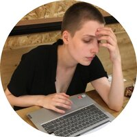

### Olga Strelkova's CV

#### Contact information📫:
**Email**: strelod@gmail.com

**Telegram**: @o1a00

#### About myself:
I&nbsp;am an&nbsp;art historian whose scholar interest lies in&nbsp;the XXth century art, modernism and specificly the art excluded from art historian studies because of&nbsp;the censorship in&nbsp;the USSR period.

My&nbsp;engagement with&nbsp;IT started from the deep understanding that the humanitarian studies had a&nbsp;vital need in&nbsp;them. Technologies for visual and big data analyses, digitalization of&nbsp;archives&nbsp;&mdash; these all can make academic research worldwide accessible and significatly more prolific.

After one and half a&nbsp;year of&nbsp;studying Java Script I&nbsp;dived deep into the world of&nbsp;programming and got absolutely convinced that it&nbsp;was not just a&nbsp;tool for the other fields but the basis of&nbsp;the future.

#### Technology stack:

• HTML • CSS • JavaScript • React + Next.js

• BEM • OOP • UX/UI design

• Node.js • Express.js • Mongo DB • PM2

• Webpack • Git • Docker • Figma 

#### Code example:

` function multiply(a, b){
  return (a * b);
} `

#### My projects:
###### Mesto - SPA for sharing photos
* [Pure JS](https://github.com/OlgaStrelk/mesto#readme)
* [React + Express](https://github.com/OlgaStrelk/react-mesto-api-full#readme)

###### Landings
* [Russian Travel](https://github.com/OlgaStrelk/russian-travel#readme)
* [How to Learn](https://github.com/OlgaStrelk/how-to-learn#readme)

#### Education:
* Yandex Praktikum: Web Developer (2021-2022)
* Rolling Scopes: Java Script and React (at present)

#### Languages:
* English *C1* (Advanced)
* Deutch *A2*
